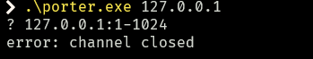

# port-scanner-in-async-rust

following [Make a port scanner in #rustlang with Tokio and learn async Rust 🦀 Learn Rust Creatively](https://www.youtube.com/watch?v=J3C6sNK2wnk) 

using [github.com/timClicks/tutorials/2024-04-portscanner](https://github.com/timClicks/tutorials/tree/main/2024-04-portscanner) as a reference

## note

in `porter`'s original implementation, the port scan does not work when a single IP address is specified:

```bash
$ porter 127.0.0.1
```

the program errors out with:


